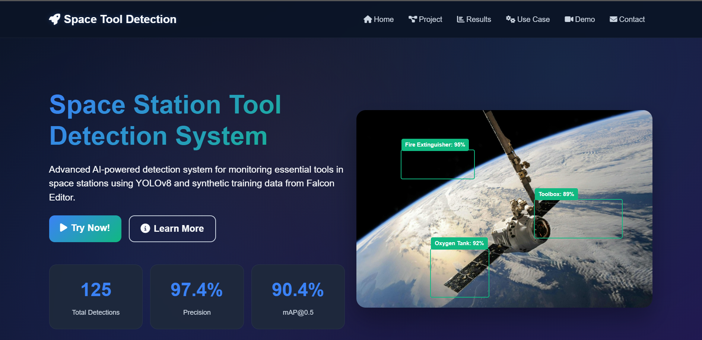
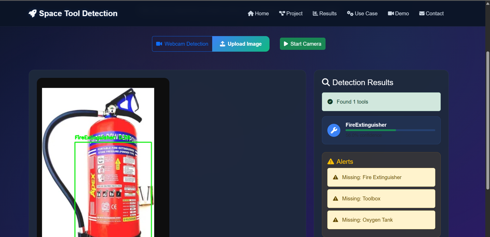

YOLOv8 Space Station Object Detection
Detecting FireExtinguisher, ToolBox, and OxygenTank in Synthetic Space Station Images

🚀 Overview
This project leverages the YOLOv8 framework to detect FireExtinguisher, ToolBox, and OxygenTank in Falcon-generated synthetic space station imagery. The pipeline—from environment setup through model training and result evaluation—is fully reproducible.

📦 Project Access
Full Project Download
To access all scripts, configuration files, trained models, outputs, and assets, download the complete project folder from Google Drive:

👉 Download the full project folder here
https://drive.google.com/file/d/1f74YSBu_m947X2nvjkN1VqK32i_8V4k-/view?usp=sharing

Note:
The GitHub repository contains only the code (scripts/configs) for convenience and versioning. All large files, datasets, training outputs, and assets are on Google Drive due to size constraints.

📚 Environment & Dependency Setup
Install Anaconda (Recommended)

Download and install from anaconda.com/download if not already present.

Set Up the Python Environment

bash
cd path\to\Hackathon_Dataset\ENV_SETUP
setup_env.bat
conda activate EDU
This creates and activates the EDU environment with Python 3.8+, PyTorch (CUDA if available), Ultralytics YOLOv8 (≥8.3.171), OpenCV, numpy, PyYAML, etc.

📂 Download & Organize the Dataset
You do not need to download the dataset separately—it is included in the full project Google Drive folder.
After downloading and extracting, your folder should look like this:

text
Hackathon_Dataset/
├── data/
│ ├── train/
│ │ ├── images/
│ │ └── labels/
│ ├── val/
│ │ ├── images/
│ │ └── labels/
│ └── test/
│ ├── images/
│ └── labels/
├── yolo_params.yaml
├── train.py
├── predict.py
└── visualize.py
Each image in images/ has a .txt label in labels/, formatted with normalized YOLO bounding boxes.

📄 Configuration
Ensure your yolo_params.yaml looks like:

text
train: data/train/images
val: data/val/images
test: data/test/images
nc: 3
names: ["FireExtinguisher", "ToolBox", "OxygenTank"]
To add extra training folders, include them as a YAML list.

🔧 Quick Start: Run & Test the Model
Activate the Environment

bash
conda activate EDU
Train the YOLOv8 Model

bash
python train.py --epochs 25 --mosaic 0.1 --optimizer AdamW --momentum 0.2 --lr0 0.001 --lrf 0.0001
Reads dataset/config paths from yolo_params.yaml.

Predict/Evaluate on Test Data

bash
python predict.py
Outputs predictions to predictions/images/ and evaluation metrics to the console.

(Optional) Visualize Labeled Data

bash
python visualize.py
Use A and D to scroll through labeled samples.

♻️ Reproducing Results
Follow steps above for environment and folder structure.

Typical expected test metrics:

mAP@0.5 ≈ 0.84

Precision ≈ 0.91

Recall ≈ 0.75

Output images in predictions/images/.

📈 Output Interpretation
Training Folders:
runs/detect/ contains logs, weights (best.pt), plots (loss curves, metrics).

Prediction Folder:
predictions/images/ holds test images with bounding boxes and confidence scores.

Metrics:

Precision: Fraction of detections that are correct.

Recall: Fraction of all true objects detected.

mAP@0.5: "Standard" detection accuracy.

mAP@0.5–0.95: Bounding box localization quality.

🛠 Troubleshooting
All images/ files must have matching .txt labels in labels/.

Confirm all folder paths are correct and relative.

Always activate the EDU environment before running code.

For large files, ensure you have enough local disk space after Google Drive extraction.

📚 References
Ultralytics YOLOv8 Documentation

YOLOv8 Annotation Format
